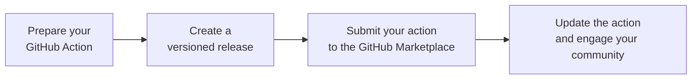
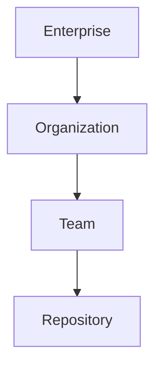

# 

# 101 Getting Started

## What is Github?
* Collaborative developer platform
* Public and private repositories
* Free, Pro, Team, Enterprise
* Home of GitHub Copilot (X)
* Source code control
* C|/CD automation
* Package management
* Collaboration

## What is Github Actions?
* Depends on the context :)
* GitHub Actions refers to the entire platform and ecosystem for creating and running automated workflows within the GitHub environment
* An action is a script invoked from within a workflow

## What are workflows?
* Automated scripts (actions) that run when specific events occur in your repository
* Efficient way to automate development tasks
* Common use cases:
    * C|/CD
    * Versioning and release management
    * Automation and notifications

## GitHub workflow event types

* Push events - When you push your code into a branch in GitHub, that push and related commit are events that can trigger workflows.
* Pull request events - When you create a pull request, that's an event that can trigger workflows
* Issue events - When you create an issue, that's an event that can trigger workflows
* Release events - When you create a release, that's an event that can trigger workflows
* Workflow dispatch events (manual)
* Scheduled events (cron)
* Webhook events (external services)

# 1. Trigger Custom Workflows

## 1.1 Configure workflows to run for one or more events

* Trigger workflow when commit is pushed
* Workflow runs when a new commit is pushed to a specific branch or repository
* Use cases:
    * Running tests after every push
    * Deploy code and infrastructure to staging environment
```yml
# Workflow runs when a new commit is pushed to a specific branch or repository
# Use cases:
# Running tests after every push
# Deploy code and infrastructure to staging environment
on :
    push:
        branches:
            - main
            - develop
```

## 1.2 Configure workflows to run for scheduled events

* Schedule-based workflow
* Workflows run automatically at specific times or intervals
* Use cases:
    * Running nightly builds
    * Performing hourly backups
```yml
on :
    schedule:
        - cron: '0 0***'    # Every day at midnight
```

## 1.3 Configure workflows to run for manual events
* Manual workflows
* Workflow runs only when manually triggered by a
user
* Use cases:
    * Deploying to a production environment
    * Running a one-time automation script

```yml
on:
    workflow_dispatch:
```

## 1.4 Configure workflows to run for webhook events
* Webhook-triggered workflows
* Workflow runs when triggered by an external event from another service
* Use cases:
    * Triggering a build when a new issue is created on GitHub
    * Deploying code to a server when a new version is released
```yml
on:
    webhook:
        url:https://example.com/my-webhook
```

## 1.5 Demonstrate a GitHub event to trigger a workflow based on a practical use case

* __Scenario:__ Automatically deploy a website to Netlify every time a new commit is pushed to the main branch
* __Implementation:__ Push a new workflow to the GitHub repo; whenever you push a new commit to main, the workflow will automatically deploy the website to Netlify
* __Workflow:__ 
```yaml
on:
    push:
        branches: [main]

jobs:
    deploy:
        runs-on: ubuntu-latest

        steps:
            - uses: actions/checkout@v3
            - name: Install dependencies
              run: npm install
            - name: Build website
              run: npm run build
            - name: Deploy to Netlify
              uses: netlify/actions/cli@v1.1
              with:
                site_id: <site_id>
                api_key: <api_key>
                args: deploy --prod
```

* __Explanation:__ In this example, that Netlify example, we're saying that whenever a push or a commit happens on main, we're then going to kick off these jobs. This job will deploy on cloud servers. They're actually called runners. That's a term you should know for your exam. Runners are GitHub hosted cloud-based VMs, and that army of virtual machines, you can choose from among them, depending upon what your use case and requirements are. There's Windows, Mac OS, and Linux runners to choose from. This example says take the latest Ubuntu distribution. And then each job consists of steps that involve references to GitHub Actions. This is the checkout@v3 action where it's doing an NPM install and a build. And then the second step here, we're using the Netlify CLI version 1.1 action to specify your API key and site ID and which environment you're deploying to. And that's everything to it. Now you would have your site ID and key protected as secrets in your repo. We'll get to all of that in the demos in due time throughout this training course. We never, ever want to have an exposed API key or password and I wouldn't even want to necessarily expose my site ID in plain text in your repo. You want to keep those as secrets and then call them, but this code at least gives us something to start with.

### Creating Workflows
1. Create new repository or use existing
2. Click __'```Actions```'__ &rarr; select __'```Configure```'__ for __'```Simple Workflow```'__
3. Now the blank.yml created under '
workflows/' as below
```yml
# This is a basic workflow to help you get started with Actions

name: CI

# Controls when the workflow will run
on:
  # Triggers the workflow on push or pull request events but only for the "main" branch
  push:
    branches: [ "main" ]
  pull_request:
    branches: [ "main" ]

  # Allows you to run this workflow manually from the Actions tab
  workflow_dispatch:

# A workflow run is made up of one or more jobs that can run sequentially or in parallel
jobs:
  # This workflow contains a single job called "build"
  build:
    # The type of runner that the job will run on
    runs-on: ubuntu-latest

    # Steps represent a sequence of tasks that will be executed as part of the job
    steps:
      # Checks-out your repository under $GITHUB_WORKSPACE, so your job can access it
      - uses: actions/checkout@v4

      # Runs a single command using the runners shell
      - name: Run a one-line script
        run: echo Hello, world!

      # Runs a set of commands using the runners shell
      - name: Run a multi-line script
        run: |
          echo Add other actions to build,
          echo test, and deploy your project.
```

> _Note 1_: Workflows(.yml) file can be created under '.github/workflows/*.yml'

> _Note 2_: *.yml file is actually intent or space sensitive, so we should use intent as 2 or more

> _Note 3_: We will get email notification once the workflow job(s) get done


# 2. Utilize Workflow Components

## 2.1 Identify the correct syntax for workflow jobs
### Workflow Jobs
* Purpose
    * Define units of work that execute specific tasks within a workflow.
* Elements
    * __jobs__: declares a job
    * __job_name__: unique name for the job (!what if we give same name for multiple jobs)
    * __runs-on__: specifies the environment where the job will run (e.g., ubuntu-latest, windows-latest, self-hosted runner name) 
    * __steps__: list of steps to be executed within the job
### Workflow Model
 - > &rarr; Workflow
    - > &rarr; Jobs
        - > &rarr; Steps
            - > &rarr; Actions

> _Note_: All the jobs are executed in parralled if there are no dependency.

## 2.2 Use job steps for actions and shell commands
### Job Steps
* Purpose
    * Define individual tasks to be executed within a job
* Elements
    * __steps__: to declare steps within a job
    * __uses__ (Optional): use a pre-build action from the GitHub Actions marketplace 
    * __action_name__: name of the action to use
    * __version__ (Optional): specific version of the action to use
    * __with__ (optional): input values for the action
    * __name__ (optional): custom name for the step
    * __run__: execute a shell command within the step

### Example: Job Steps
```yml
# This is a basic workflow to help you get started with Actions
name: Example Workflow for Job Steps 
on:
    push:
        branches:
            - main
jobs:
    example_job:
        runs-on: ubuntu-latest
        steps:
        - name: Checkout Repository # name: Custom name for the step 
          uses: actions/checkout@v2 # uses: Use a pre-built action
        - name: Set up Node. js # name: Custom name for the step 
          uses: actions/setup-node@v2 # action_name: Name of the action to use 
          with: # with: Input values for the action
            node-version: '14'
        - name: Install Dependencies # name: Custom name for the step 
          run: npm install # run: Execute a shell command within the step
        - name: Run Tests # name: Custom name for the step
          run: npm test # command_to_execute: Shell command to be executed
```

## 2.3 Use conditional keywords for steps
### Conditional Statements
* Purpose
    * Control the execution of steps based on specific conditions
* Keywords
    * if: execute a step only if a condition is true
    * else: execute a step if the if condition is false
    * needs: specify that a step depends on another job completing
    
### Example: Conditional jobs
```yml
# This is a basic workflow to help you get started with Actions
name: Conditional Jobs

# Controls when the workflow will run
on:
  # Allows you to run this workflow manually from the Actions tab
  workflow_dispatch:

# A workflow run is made up of one or more jobs that can run sequentially or in parallel
jobs:
    initial-job:
        runs-on: ubuntu-latest
        steps:
        - name: Checkout Repository
          uses: actions/checkout@v2
        - name: Run a command
          run: echo "This is the initial job."

    conditional-job:
        needs: initial_job # This job depends on the completion of 'initial_job'
        runs-on: ubuntu-latest
        steps:
        - name: Execute on specific condition
          run: echo "This step runs because the condition is true."
          if: github.ref == 'refs/heads/main' # Condition to check if branch is 'main'
        - name: Alternative step for false condition
          run: echo "This step would run if the above condition was false."
          if: github.ref != 'refs/heads/main' # This condition is opposite of the above

```


## 2.4 Describe how actions, workflows, jobs, steps, runs, and the marketplace work together
### GitHub Actions vocabulary review
* __Workflow__ : Overall automation script defined in a YAML file
* __Jobs__ : Units of work within a workflow, each with its own steps
* __Steps__ : Individual tasks within a job, executed using actions or shell commands
* __Actions__ : Pre-built scripts that provide reusable functionality which will get from GitHub actions marketplace.
* __Shell commands__ : Custom scripts written to perform specific tasks
* __Runs__: Specific executions of a workflow triggered by events
* __Marketplace__ : Central repository for discovering and sharing
actions


## 2.5 Identify scenarios suited for using GitHub-hosted and self-hosted runners

### GitHub Actions runners
1. GitHub-hosted runners
    * Free to use
    * Limited resources available
    * Pre-configured with commonly used software
    * Suitable for simple workflows and open-source projects
2. Self-hosted runners
    * More control over the environment
    * Can be used to run workflows on specific hardware or software
    * Require more maintenance

>___Note___: If you have some maybe special-er cases or edgier cases for automation, you may find that the GitHub-hosted runners don't have that version of a library that you need or don't have a library, and because you can't touch those Cloud machines too much, you may be forced to do it yourself with a self-hosted runner.

## 2.6 Implement workflow commands as a run step to communicate with the runner

### Workflow commands
* Purpose
    * Interact with the runner during workflow execution
* Commands
    * set-output: Store a value for subsequent steps
    * upload-artifact: Upload an artifact to be used in other workflows
    * download-artifact: Download an artifact uploaded in another workflow
    * echo: Print a message to the workflow logs

### Example: Workflow commands
```yml
name: Workflow Commands
.
.
.
steps:
    - name: Set output
    run: echo "My output is: SMY_VARIABLE"
    - name: Upload artifact
    uses: actions/upload-artifact@v3
    with:
        name: my-artifact
        path: /path/to/artifact
    - name: Download artifact
    uses: actions/download-artifact@v3
    with:
        name: my-artifact
        path: /path/to/download
```

## 2.7 Demonstrate the use of dependent jobs
### Dependent Jobs
* Purpose
    * Ensure specific tasks are executed in a specific order
* Benefits
    * Improved workflow control and execution flow
    * Prevent errors or inconsistencies by guaranteeing specific tasks are completed before others
    * Useful for scenarios with dependencies between tasks
### Example: Dependent Jobs
```yml
.
.
.
jobs:
    build:
        runs-on: ubuntu-latest 
        steps:
            - uses: actions/checkout@v3
            - run: npm install
            - run: npm run build
            - name: Upload build artifact
              uses: actions/upload-artifact@v3 
              with:
                name: build
                path: /path/to/build
    deploy:
        needs: build
        runs-on: ubuntu-latest
        steps:
            - uses: actions/download-artifact@v3
              with:
                name: build
                path: /path/to/build
            - run: ./deploy.sh
```

### Contexts 
 - Contexts are a way to access information about workflow runs, variables, runner environments, jobs, and steps. Each context is an object that contains properties, which can be strings or other objects.


# 3. Secure Workflow Data

## 3.1 Use encrypted secrets to store sensitive information

### The importance of securing data
* Protecting sensitive information like passwords, access tokens, and API keys is crucial
* Data breaches can have severe consequences for organizations and individuals
* GitHub Actions provides several features for secure
data handling

### Use encrypted secrets
* Definition
    * Secure storage for sensitive data like API keys
* Usage
    * Accessible by workflows in the same repository
* Setup
    * github.com &rarr; Settings &rarr; Secrets &rarr; New repository secret

### Example: Encrypted Secrets
```yml
name: My workflow
on: push
jobs:
    build:
        runs-on: ubuntu-latest
        steps:
            - uses: actions/checkout@v3
            - name: Install dependencies
              run: npm install
            - name: Build the code
              run: npm run build
            - name: Deploy the code
              run: |
            # Use the value of the encrypted SECRET_KEY secret
            ./deploy.sh ${{ secrets.SECRET_KEY }}
```


## 3.2 Identify the available default environment variables during the construction of the workflow

### Default environment variables
* Definition
    * Pre-set variables like ```GITHUB_REPOSITORY```
* Purpose
    * Provide context about the current run
* Usage
    * Referenced directly in workflow files


## 3.4 Identify the location to set custom environment variables in a workflow

### Set custom environment variables
* Definition
    * User-defined variables for specific needs
* Setting
    * Use the ```env``` key in your workflow YAML

### Example: Set custom environment variables
```yml
env:
 MY_VARIABLE: "Value"
```

## 3.5 Identify when to use the github_token secret

### The ```GITHUB_TOKEN``` secret
* Definition
    * Auto-generated token for authentication
* Purpose
    * Interact with the GitHub API securely
* Usage 
    * Provided in every run, no manual setup needed

### Example: The ```GITHUB_TOKEN``` secret
```yml
name: My workflow 
on: push 
jobs:
    build:
        runs-on: ubuntu-latest
        steps:
            - uses: actions/checkout@v3
            - name: Download artifacts
              uses: actions/download-artifact@v3
              with:
                name: artifacts
                path: /path/to/artifacts
            - name: Run tests
              run: |
                # Use the GITHUB_TOKEN to access the private repository
                curl -H "Authorization: Bearer ${{ secrets.GITHUB_TOKEN }}" https://api.github.com/repos/...
            - name: Upload artifacts
              uses: actions/upload-artifact@v3
              with:
                name: test_results
                path: /path/to/test_results
```

## 3.6 Demonstrate how to use workflow commands to set environment variables

### Workflow commands and environment variables
* Definition
    * Commands to set env variables dynamically
* Example
    * ```echo "VAR_NAME=value" >> $GITHUB_ENV```
* Benefit
    * Flexibility in setting values based on runtime conditions

### Setting secrets to repository
1. Open repository
2. Click __```Settings```__ for the repository
3. Select __```Secrets and Variables```__ under ```Security``` section
4. Select __```Secrets```__
5. Click __```New repository secrets```__
6. Provide 'Name' and 'Secret' then click __```Add Secret```__

# 4. Craft Purposeful Workflows

## 4.1 Add a script to a workflow
### Adding a script to a workflow
* Execute custom scripts
    * Use the run keyword in your workflow file to execute any script
    * For example, run a script to install dependencies
* Integrate scripts with workflow
    * Pass arguments to your script to configure its behavior
    * Use environment variables to access information from the workflow

### Example: Install Dependencies
```yml
.
.
.
name: Flask App CI
on: [push, pull_request]
jobs:
    build:
    runs-on: ubuntu-latest
    steps:
    - uses: actions/checkout@v3
    - uses: actions/setup-python@v3
        with: {python-version: '3.10', cache: 'pip'}
    - run:  |
        python -m pip install --upgrade pip
        pip install -r requirements.txt
```

## 4.2 Demonstrate how to publish to GitHub Packages using a workflow
### Publishing to GitHub Packages
* Workflow setup
    *  __Upload package__: Use the __actions/upload-artifact__ action to upload your package
    * __Automation__: Set the workflow to trigger on ___push___ events to automatically publish on code changes
* Credential configuration
    * __Repository access__: Use the ___actions/checkout___ action to access your repo and access the ___requirements.txt___ (Python) file for authentication along with PAT
    * __Security__: Use secret variables for secure credentials

### Example: Fetch from GithHub Packages
```yml
name: Fetch GitHub Package
on: [push, pull_request]
jobs:
    fetch-package:
    runs-on: ubuntu-latest
        steps:
        - uses: actions/checkout@v3
        - name: Setup Node.js
          uses: actions/setup-node@v3
          with:
            node-version: '14'
            registry-url: 'https://npm.pkg.github.com'
        - name: Install package
          run: npm install @your-username/your-package-name
          env :
            NODE_AUTH_TOKEN: ${{secrets.GITHUB_TOKEN}}
```

## 4.3 Demonstrate how to publish to GitHub container registry using a workflow
### Publishing to GitHub Container Registry
* Build container image:
    * Use Docker to build container image within the workflow
    * Use the ___docker/build-push-action___ action to automatically build and push the image to GitHub Container Registry
* Trigger workflow:
    * Trigger the workflow on push events to rebuild and push the image on code changes. You can also trigger it manually or on specific branches
* Manage image versions:
    * Use tags to manage different versions of your image

### Example: Publishing to GitHub Container Registry

```yml
name: Publish to GHCR
on: push
jobs:
    publish:
        runs-on: ubuntu-latest
        steps:
        - uses: actions/checkout@v3
        - name: Log in to GitHub Container Registry
          uses: docker/login-action@v2
          with:
            registry: gher.io
            username: ${{ github.actor }}
            password: ${{ secrets.GITHUB_TOKEN }}
        - name: Build and push
          uses: docker/build-push-action@v3
          with:
            push: true
            tags: ghcr.io/${{ github.repository ///your-image-name:latest
```

## 4.4 Use database and service containers in a GitHub actions workflow
### Using database and service containers
* Database container
    * Use tools like ___docker-compose___ to define and manage database containers like Postgres or MySQL
    * Start the container before running your tests or application
* Service container
    * Use service containers for Redis caching, web servers, or background workers
    * Use environment variables to configure service connections within your workflow

### Example: Using database and service containers
```yml
name: DB Workflow
on: push
    jobs:
        test:
            runs-on: ubuntu-latest
            services:
                postgres:
                    image: postgres:latest
                    env:
                        POSTGRES_PASSWORD: postgres
                    ports:
                        - 5432:5432
            steps:
            - uses: actions/checkout@v3
            - run: |
                # Add commands to interact with the database
```

## 4.5 Use labels to route workflows to specific runners
### Using labes to route workflows
* Define labels
    * Add labels to your workflow file to specify which runners should execute it
    * You can use labels for different environments, operating systems, or other criteria (Use the runner context for cloud runners)
* Configure self-hosted runner pools
    * Create runner pools with specific configurations and assign labels to them
    * This allows you to manage resources and ensure your workflows run on appropriate runners
* Routing examples
    * Use labels to route workflows to runners with specific GPUs for machine learning tasks
    * Use labels to route workflows to runners with specific softwares installed for testing

> ___Note:___  It doesn't matter, if it's an on-premises physical or virtual machine, or if it's an EC2 instance, an Amazon or an Azure VM. You essentially, you can run a shell script or a PowerShell script that GitHub gives you. It's a console application as you can see and you can pretty much just next, next finish. 

### Example: Using labes to route workflows
```yml
.
.
.
jobs:
    my_job:
        runs-on: ubuntu-latest
        steps:
        - name: Checkout Repository
            uses: actions/checkout@v3
        # Other steps follow
```

## 4.6 Use codeql as a step in a workflow
### Using CodeQL in a workflow
* CodeQL integration
    * Integrate CodeQL into your workflow using the ___github/codeql-action___ action
    * This action allows you to scan your code for vulnerabilities and security risks
* Configure analysis
    * Specify which languages and CodeQL packs to use for analysis
    * You can also specify which files to include or exclude from analysis
* Reporting and remediation
    * Review the CodeQL findings and address security vulnerabilites identified in your codebase.
    * Integrate CodeQL into your continuous integration pipeline for proactive security.
    * You can also use the ___github/codeql-action___ action to automatically fix some vulnerabilities

> ___Note:___ CodeQL is not an open-source vulnerability scanner. That's what __Dependabot__ is for. Dependabot is another bot that you can configure to always run in your repos.

## 4.7 Demonstrate how to publish a component as a GitHub release using GitHub actions
### Publishing a component as a GitHub release
* Release workflow
    * Use the ___actions/create-release___ action to create a release with information like release notes and assets.
    * Trigger this workflow on ___release___ events
* Generate release notes
    * Use tools like ___conventional-changelog___ to automatically generate release notes based on commits and issue tracker entries.
* Manage assets
    * Upload relevant files like binaries, documentation, or examples as assets along with your release
### Example: Publishing a component as a GitHub release
```yml
jobs:
    release:
        runs-on: ubuntu-latest
        steps:
        - name: Create a release
          uses: actions/create-release@v2
          with:
            tag_name: 1.0.0
            release_name: "Release v1.0.0"
            body: "This release includes bug fixes and new features..."
            draft: false
```

## 4.8 Deploy a release to a cloud provider using a GitHub actions workflow
### Deploying a release to the Azure cloud
* Cloud platform integration
    * Use ARM and Bicep to automate deployments
    * Use tools like the Azure CLI to interact with specific services
* Trigger deployement
    * Trigger the deployment workflow on release events to automatically deploy new code to your cloud environment
    * You can also trigger it manually or on specific tags
* Manage environments
    * Use different workflows or environment variables to deploy to different environments like staging or production
### Example 1: Deploy a release to a cloud provider - AWS
```yml
jobs:
    deploy:
        runs-on: ubuntu-latest
        steps:
        - uses actions/checkout@v2
        - name: Login to AWS
          if: env.DEPLOY_TARGET == 'aws'
          uses: aws-actions/configure-aws-credentials@v1
          with:
            aws-access-key-id: ${{secrets. AWS_ACCESS_KEY_ID}}
            aws-secret-access-key: ${{secrets. AWS_SECRET_ACCESS_KEY}}
            region: ${{env.AWS_REGION}}
        - name: Deploy the application to AWS
          if: env.DEPLOY_TARGET == 'aws'
          run: aws deploy --application-name ${{env.AWS APPLICATION_NAME}} --version ${{github.sha}}
```
### Example 2: Deploy a release to a cloud provider - Azure
```yml
jobs:
    deploy:
        runs-on: ubuntu-latest
        steps:
        - uses: actions/checkout@v2
        - name: Login to Azure
          if: env.DEPLOY_TARGET == 'azure'
          uses: azure/login@v1
          with:
            creds: ${{secrets. AZURE_CREDENTIALS}}
        - name: Deploy the application to Azure
          if: env.DEPLOY_TARGET == 'azure'
          run: az webapp deployment create --resource-group ${{env. AZURE RESOURCE_GROUP}} --name ${{env. AZURE_APP_NAME}} --slot ${{env. AZURE_SLOT}} --source ${{github.sha}}
```
### Setup of Self-Hosted Runners
1. Open Repository __```Settings```__
2. Navigate __```Actions```__ &rarr; __```Runners```__ and click __```New self-hosted runner```__ button
(https://github.com/ganeshk627/GitHub-Actions-Cert-Prep-by-Microsoft-Press/settings/actions/runners)
3. Select Runner Image as ```macOs``` or ```Linux``` or ```Windows```
4. Select Architecture as ```x64``` or ```arm64```
5. Copy paste the ```Download``` commands to the target machine
```bash
# Create a folder under the drive root
$ mkdir actions-runner; cd actions-runner

# Download the latest runner package
$ Invoke-WebRequest -Uri https://github.com/actions/runner/releases/download/v2.317.0/actions-runner-win-x64-2.317.0.zip -OutFile actions-runner-win-x64-2.317.0.zip

# Optional: Validate the hash (hash ah modify panita)
$ if((Get-FileHash -Path actions-runner-win-x64-2.317.0.zip -Algorithm SHA256).Hash.ToUpper() -ne 'a74dcd16124sdfdeaf4b11dsfdsf5b3db5a43a4f459c1d3c1807f8148aeb9530d69826'.ToUpper()){ throw 'Computed checksum did not match' }

# Extract the installer
$ Add-Type -AssemblyName System.IO.Compression.FileSystem ; [System.IO.Compression.ZipFile]::ExtractToDirectory("$PWD/actions-runner-win-x64-2.317.0.zip", "$PWD")
```
6. Copy paste the ```Configure``` commands to the target machine
```bash
# Create the runner and start the configuration experience
$ ./config.cmd --url https://github.com/ganeshk627/GitHub-Actions-Cert-Prep-by-Microsoft-Press --token NAMAATHITTASOITHUVELASEIIYAATHU

# Run it!
$ ./run.cmd
```
7. Now good to go with executing jobs in our self-hosted runners by specifying the tags such as ```self-hosted``` or ```HOST-MACHINE``` in our workflow file
```yml
. . .
        runs-on: self-hosted
. . .
```
8. We could find the runners and runner labels under ```actions/runners```
9. To edit or add label to a particular runner, select the runner and click the Settings icon ```⚙️```.

> __Note 1:__ Github recommends configuring the runner under "\actions-runner". This will help avoid issues related to service identity folder permissions and long path restrictions on Windows.
> __Note 2:__ Use Windows PowerShell as Adminstrator if windows machine used to configure

### Problems:
#### Problem 1 - Windows 10: Getting below error in github actions log while excuting our commands
```bash
Run echo 'Hello buddy'
. : File C:\actions-runner\_work\_temp\ba6d7e25-e877-4d50-8ba0-5c1128dcb5f8.ps1 cannot be loaded because running 
scripts is disabled on this system. For more information, see about_Execution_Policies at 
https:/go.microsoft.com/fwlink/?LinkID=135170.
At line:1 char:3
+ . 'C:\actions-runner\_work\_temp\ba6d7e25-e877-4d50-8ba0-5c1128dcb5f8 ...
+   ~~~~~~~~~~~~~~~~~~~~~~~~~~~~~~~~~~~~~~~~~~~~~~~~~~~~~~~~~~~~~~~~~~~
    + CategoryInfo          : SecurityError: (:) [], PSSecurityException
    + FullyQualifiedErrorId : UnauthorizedAccess
Error: Process completed with exit code 1.
```

#### Solution:
1. Open PowerShell as Administrator
2. You can choose a more permissive execution policy, such as ```RemoteSigned``` or ```Unrestricted```. For example, to set the execution policy to ```RemoteSigned```, which allows scripts created on the local computer to run, but requires that scripts downloaded from the internet be signed by a trusted publisher. If you want to allow all scripts to run, you can set the policy to ```Unrestricted```.
```pwsh
Set-ExecutionPolicy Unrestricted
```
> ⚠️ __Caution__ : Be cautious when changing the execution policy to Unrestricted, as it allows all scripts to run, which could potentially pose a security risk.
If you only want to change the policy for the current PowerShell session, you can use the -Scope Process parameter instead of -Scope LocalMachine.
3. To verify the execution policy, you can check the current execution policy by running below command
```pwsh
Get-ExecutionPolicy
```
4. Re-run the job(s) after re-run the Github Actions runner, now the jobs should get executed


# 5. Optimize Workflow Runs
## 5.1 Configure caching of workflow dependencies
### Caching workflow dependencies
* Avoid re-downloading dependencies for every job run
* Cache specific paths or directories for faster execution
* Use multi-level cache for nested dependencies
* Set cache expiration based on file changes or workflow tags
### Example: Caching workflow dependencies
```yml
jobs:
    build:
        runs-on: ubuntu-lateste
        steps:
          - uses: actions/checkout@v3
          - name: Cache Node.js modules
            uses: actions/cache@v2
            with:
                path: node_modules
                key: ${{ runner.os }}-node-${{ hashFiles('package-lock.json')}}
                restore-keys: |
                    ${{ runner.os }}-node-
. . .
```

## 5.2 Identify steps to pass data between jobs in a workflow
### Passsing data between workflow jobs
* Share information and artifacts between jobs for efficient workflows
* Define outputs from individual steps to pass data
* Leverage environment variables for secrets and configuration
* Manage resource usage with job concurrency limits
### Example: Pass data between workflow jobs
```yml
jobs:
    build:
        runs-on: ubuntu-latest 
        steps:
          - ... build steps ...
          - name: Upload build artifacts
            uses: actions/upload-artifact@v2
            with:
              name: application
              path: build/app.zip
    test:
        runs-on: ubuntu-latest
        needs: build
        steps:
          - name: Download build artifacts
            uses: actions/download-artifact@v2
            with:
              name: application
          - name: Run tests
            ... test steps using the downloaded application ...
```

## 5.3 Remove workflow artifacts from GitHub
### Removing workflow artifacts from GitHub
* Automatically remove outdated or unused artifacts
    * 90/30 day retention for artifacts in public/private repos
* Integrate cleanup actions with workflow triggers
* Use different retention policies for diverse artifact
types
* Leverage GitHub's built-in artifact management for control
### Example: Remove workflow artifacts from GitHub
```yml
jobs:
    cleanup:
        runs-on: ubuntu-latest
        steps:
          - uses: actions/stale@v1
            with:
                days: 7
                repository: ${{ github.repository }}
                token: ${{ secrets.GITHUB_TOKEN }}
```

## 5.4 Add a workflow status badge
### Adding a workflow status badge
* Visually display the current status of your workflow
* Customize the badge with colors and icons
* Integrate badges into dashboards or project documentation
* Use dynamic badges for real-time updates
```markdown
[](https://github.com/your-username/your-repository/actions)
```
[](https://github.com/your-username/your-repository/actions)

## 5.5 Add environment protections
### Adding environment protections
* Enforce security and control access to sensitive data
* Implement least privilege for secrets and environment variables
* Utilize masking to obfuscate sensitive data in logs
* Integrate advanced secret management and access control tools
### Example: Adding environment protections
```yml
env:
    API_KEY: ${{ secrets.API_KEY }}
jobs:
    update-api-key:
        runs-on: ubuntu-latest
        steps:
          - name: Change API Key
            env :
                API_KEY: ${{ secrets.NEW_API_KEY }}
            requires:
                - approval
```

## 5.6 Define a matrix of different job configurations
### Defining a matrix of different job configurations
* Run multiple jobs with diverse configurations in a single workflow
* Use parameterized steps for adaptable workflows
* Leverage matrix combinations for efficient testing
* Integrate matrix with other features for advanced automation
### Example: Defining a matrix of different job configurations
```yml
jobs:
    test:
        strategy:
          matrix:
            os: [windows-latest, macos-latest]
            node_version: [14, 16]
        runs-on: ${{ matrix.os}}
        steps:
          - ... test steps using the matrix values ...
```

## 5.7 Implement workflow approval gates
### Workflow approval gates
* Require manual approval before critical workflow
stages
* Define approval criteria and reviewers for sensitive
actions
* Integrate with Teams, Slack, or other communication channels for notifications


# 6. Analyse Workflow Effects
## 6.1 Identify the event that triggered a workflow from its effects in a repository, issue, or pull request
### Event trigger identification
* Review GitHub Actions logs to pinpoint the triggering event (push, pull request, issue creation, etc.)
* Logs are retained for 90 days by default
    * Adjustable to 90d (public) and 400d (private)
* Use __`${{ github.event_name }}`__ in your workflow to dynamically identify the event type
* _Example_: Trigger workflow on push event and include logic to handle different event types
### Example: Event trigger identification
```yml
name: Identify Event Type
on: [push, pull_request, issues]

jobs:
    identify-event:
        runs-on: ubuntu-latest
        steps:
            - name: Check Event Name
              run: echo "This workflow was triggered by a ${{ github.event_name }} event."
```
## 6.2 Describe a workflow's effects from reading its configuration file
### Analysing workflow configuration
* The goal is for you to understand a workflow's effects and impact without running it
* Break down the __.yml__ file to understand the workflow steps and actions used
* Correlate actions in the workflow with effects (build, test, deploy, etc.)
* _Example_: A workflow with __actions/checkout__ and __actions/upload-artifact__ for building and storing results
## 6.3 Diagnose a failed workflow run
### Diagnosing workflow failures
* Check error messages and exit codes in the Actions log for failure insights
* Review common failure causes: syntax errors, missing secrets, external service downtime
* _Example_: Debugging a failed build step due to missing environment variables
## 6.4 Identify ways to access the workflow logs from the user interface
### Access logs via the UI
* Navigate to the Actions tab in your repository to view workflow runs
* Select a specific workflow run to access detailed
logs
* _Example_: Locating and examining logs of a failed deployment step
## 6.5 Identify ways to access the workflow logs from the REST API in GitHub
### Logs via GitHub Rest API
* Use GitHub's REST API endpoint __GET /repos/{owner}/{repo}/actions/runs/{run_id}/logs__
* Authenticate API requests with a personal access token
* _Example_: __curl__ command to download logs of a specific
workflow run
## 6.6 Enable step debug logging in a workflow
### Enabling debug logging
* Set the secret __ACTIONS_STEP_DEBUG__ to __true__ to enable detailed logging for workflows
* Set the secret __ACTIONS_RUNNER_DEBUG__ to __true__ to enable detailed logging on your runners
* Review debug logs for step-by-step execution
details
* _Example_: Enabling debug logging to troubleshoot a
failing test step
> _Note:_ We don't have to set both to true. We'd only want to keep them to true when we want to turn debug logging on in our repo. 
## 6.7 Demonstrate how to use default environment variables in a workflow
### Default environment variables
* Use built-in variables like __GITHUB_SHA__ and __GITHUB_REPOSITORY__
* Incorporate these variables in workflow steps for dynamic behavior
* _Example_: Using __GITHUB_SHA__ to tag a built Docker image
### Example: Using default environment variables in a workflow
```yml
name: Tag Docker Image
on: push
jobs:
    docker:
        runs-on: ubuntu-latest 
        steps:
            - name: Checkout Code
              uses: actions/checkout@v2
            - name: Build and Tag Docker Image
              run: |
                docker build -t my-app:${{ github.sha }} .
                # Uses GITHUB_SHA to tag the Docker image
```
## 6.8 Demonstrate the correct syntax for passing custom environment variables in a workflow step
### Custom environment variables
* Declare custom environment variables under __env__ at the workflow or job level
* Access them using __${{ env.VAR_NAME }}__ in your workflow
* _Example_: Setting and using a custom __DEPLOY_ENV__ variable for conditional steps


# 7. Navigate Workflow Assets
## 7.1 Describe where to locate a workflow in a repository
### Locating workflows
* Workflows are stored in __```.github/workflows```__ directory in a Github repository
* Each workflow is defined in a separate __.yml__ or __.yaml__ file
* Browse the repository's file structure to find and view workflow files
## 7.2 Explain the difference between disabling and deleting a workflows

### Disabling Vs. deleting workflows
* Disabling a workflow
    * Temporarily prevents the workflow from runnning without deleting the file
* Deleting a workflow
    * Permanently remvoes the workflow file from the repository
* Disabling is useful for maintenance or testing; deleting is for workflows no longer needed
## 7.3 Demonstrate how to download workflow artifacts from the user interface
### Generating an artifact
```yml
name: Optimized Workflow
on: push

jobs:
    build:
        runs-on: ubuntu-latest
        steps:
        - name: Checkout Code 
          uses: actions/checkout@v3 

        - name: Build Project
          run: npm make build

        - name: Archive Production Atrifacts
          uses: actions/upload-artifact@v3
          with:
            name: build-artifacts
            path: path/to/artifacts/
```
### Downloadingh artifacts
* Artifacts are generated by a workflow run (like logs, binary files, etc.)
* Navigate to __Actions__ tab, select a workflow run, and find the __Artifacts__ section to download.
* Useful for retrieving build outputs, test results, logs, etc.
## 7.4 Describe how to use an organization's templated workflow
### Templated workflows
* Organizations can crete resuable workflow templates for consisten CI/CD practices.
* Templates are stored in the __.github__ directory in a special repository named __.github__
* Use these templates by referencing them in the workflow files of other repositories.
### Using a centralized workflow template
```yml
name: use organization template
on: push

jobs: 
    build-and-test:
        users: organization/.github/.github/workflows/template-workflow.yml@main
        with:
            some-parameter: value
        
```
> ___Note___: Unless you're in an organization, you won't have your custom workflows populated on new workflow creation page. But if you are in an organization, your organization managers can actually have all of your organization share templates available on the Choose a workflow page, which is really handy. 
### Creating templates
1. Create new repo called __.github__ as public or private
2. Create __template-artifact.yml__ as below
```yml
name: tesmplate-artifact

on:
    workflow_call:

jobs:
    build:
        runs-on: ubuntu-latest

        steps:
        - name: Print Runner Hostname and IP
          run: |
            echo " Runner hostname: $(hotname)"
            curl http://ipinfo.io/ip

        - name: Create cert.txt
          run: echo "Certificate content" > cert.txt

        - name: Zip the cert.txt
          run: zip cert.zip cert.txt

        - name Upload Artifact
          uses: actions/upload-artifact@v3
          with: 
            name: cert.zip
            path: cert.zip
```
3. Create __template-package.yml__ as below
```yml
name: template-package

on: workflow_call

jobs:
    package-and-upload:
        runs-on: ubuntu-latest
        steps: 
            - name: Checkout repository
              uses: actions/checkout@v3
            
            - name: Setup Python
              uses: actions/setup-python@v3
              with:
                python-version: '3.8'

            - name: Build package
              run:  |
                mkdir hello_world_package
                echo "def hello():\n    print('Hello, world!')" > hello_world_package/__init__.py
                echo "[metadata]\nname = hello_world_pacakge\nversion = 0.0.1" > setup.cfg
                echo "from setuptools import setup\nsetup()" > setup.py

            - name: Build pacakge
              run:  | 
                python -m pip install --upgrade build
                python -m build

            - name: Publish package
              run:  |
                python -m pip install twine
                python -m twine upload --repository-url https://nuget.pkg.github.com/ganeshk627 --skip-existing dist/*
              env:
                TWINE_USERNAME: ${{ github.actor}}
                TWINE_PASSWORD: ${{ secrets.GITHUB_TOKEN }}
```
4. Create __use-template.yml__ as below
```yml
name: use-template

# on: [push]
on: 
    push:
    workflow_dispatch:

jobs: 
    call-template:
        uses: ganesk627/.github/.github/workflows/template-artifact.yml@main
```
5. So now we could see two runs happening in Actions tab whose are template-template and template-package

# 8. Employ Trustworthy Actions
## 8.1 Define the indicators of what makes a trustworthy action
### Trustworkthy action indicators
* __Source__: Prefer actions hosted in public, reputable repositories
* __Maintenance__: Regular updates and active issue resolution indivate good maintenance
* __Comminity Trust__: High number of stars, forks, and positive feedback
* __Documentations__: Clear, detailed documentation with examples
## 8.2 Identify an action's type, inputs, and outputs
### Action's type, inputs, and outputs
* __Type__: Public vs Private, JavaScript vs Docker container actions
* __Inputs__: Parameters passed to the actions (defined in action's action.yml)
* __Outputs__: Data that action returns after execution (also defined in action.yml)
* __Usage__: Refer to action's documentation for understanding its inputs/outputs
### Example: Trustworkthy action indicators
```yml
name: Example Workflow
on: push
jobs: 
    greet:
        run-on: ubutu-latest
        step:
            - name: Greeting Action
              id: greet
              uses: actions/hellow-world-javascript-action@v1.1
              with:
                who-to-greet: 'World'
            - name: Get the greeting time
              run: echo "the time was ${{steps.greet.outputs.time}}
```
### Explanation: 
All right, the Greeting Action step here. Uses, remember, is how we reference a particular action, and we also saw an alternate use of uses when we have workflows that are centralized in your organization's .github repo. But here, we're using the action version number and the importance of it. Here is data that's being input or expected by that action, and then in this example, we're using the run keyword to just echo some data in the runner console and in the workflow logs that steps into the steps context to just cascade into the output data and grab the time that the workflow is finished.
## 8.3 Demonstrate how to use the specific version of an action in a workflow
### Specific version of an action
* Always specify a specic version of an action to use (v1.2.3 or commit SHA)
* Avoid using tags like master or latest to ensure reliability
* Using a specific version prevents unexpected changes due to action updates
### Example: Specific version of an action
```yml
name: Version Specific Workflow
on: push
jobs:
    build:
        runs-on: ubuntu-latest
        steps:
            - name: Checkout
              uses: actions/checkout@v2
            - name: Setup Node.js
              uses: actions/setup-node@v2.1.5
              with:
                node-version: '14'

```
- actions/checkout &rarr; v2
- actions/setup-node &rarr; v2.1.5
### Bicepfile (new-storage-account.bicep)
```bicep
param location string = 'eastus'
param storageAccountName string = 'harrypotteractions'
param replication string = 'LRS'

resource storageAccount 'Microsoft.Storage/storageAccounts@2021-09-01' = {
  name: storageAccountName
  location: location
  sku: {
    name: replication
  }
  kind: 'StorageV2'
}
```
### Workflow File (sample.actions.yml)
```yml
name: 'Example GitHub Action'
description: 'This action performs an example task based on inputs and provides outputs.'

# Inputs define what user can pass to your action

inputs:
    input1:
        description: 'The first input parameter.'
        required: true
        default: 'default1'
    input2:
        description: 'The second input parameter.'
        required: false
        default: 'default2'

# Outputs define what this action provides to subsequent steps
outputs: 
    output1:
        description: 'The first output parameter.'
    output2:
        description: 'The second output parameter. 

# The 'runs' block defines the environment and command that runs when the action exectues
runs: 
    using: 'docker' # This action runs in a Docker container
    image: 'Dockerfile' # path to Dockerfile

# `entrypoint` and `args` can be used to define how the Docker container is executed
# entrypoint: 'path/to/entrypoint.sh'

# args:
# - '${{inputs.input1}}'
# - '${{inputs.input2}}'
```
### Example: Convert Bicepfile to JSON
```yml
name: Convert Bicepfile to JSON
on: push
jobs:
    build:
        runs-on: ubuntu-latest
        steps:
            - name: Checkout
              uses: actions/checkout@v3
            - name: bicept-build-output
              uses: Azure/bicep-build-action@v1.0.1
              with:
                bicepFilePath: 'new-storage-account.bicep.bicep'
                outputFilePath: 'new-storage-account.bicep.json'
```

# 9. Select Action Types
## 9.1 Identify the type of action required for a given problem
### Identifying action types
* Understand the problem: Determine if it's a build, test, deploy, or a custom task
* Choose action type: Use JavaScript actions for cross-platform tasks and quick execution
* Docker actions: Prefer for tasks requiring specific environment setup or dependencies
* Community actions: Explore GitHub Marketplace for existing solutions
### Example: Identifying action types
```yml
name: Build and Test
on: push
jobs: 
    build-and-test:
        run-on: ubutu-latest
        step:
            - name: Checkout Code
              uses: actions/checkout@v3
              
            - name: Setup Node (javascript Action)
              uses: actions/setup-node@v1

            - name: Build and Test (Custom Docker Action)
              uses: docker://ghcr.io/username/custom-action:latest

```
## 9.2 Demonstrate how to troubleshoot javascript and docker container actions
### Troubleshooting Javscript actions
* Check action logs: Check logs for errors or unexpected behaviors
* Validate action's inputs: Ensure correct and expected inputs are provided
* Dependency issues: Make sure all necessary packages and versions are correctly specified
* Action's code: Examine the JavaScript source code for the action (if open source)
### Example: Debugging Javscript actions
```yml
name: Debug JS Action

on: push

jobs:
  debug:
    runs-on: ubuntu-latest
    steps:
      - name: Problematic Action
        id: problematic
        uses: actions/problematic-action@v1
        with:
          some-input: 'value'
        # Add environment variable to enable detailed logging
        env:
          ACTIONS_STEP_DEBUG: true
```

# 10. Detail Action Components
## 10.1 Identify the files and directory structure needed to create an action
### Action's files and directory structure
* Main directories: 
    * __src__ for source code
    * __lib__ for compiled code (for Javascript actions)
* Required files:
    * __action.yml__ or __action.yaml__ (contains metadata about the action)
    * __README.md__ (documentation for the action)
* Optional files:
    * LICENSE
    * .gitignore
    * other dependencies or configuration files
### Example: Action's files and directory structure
```filesystem tree
my-action/
├── action.yml
├── README.md
├── .gitignore
├── src/
│ └── index.js
├── lib/
│ └── index.js

```
## 10.2 Identify the metadata and syntax needed to create an action
### Action metadata and syntax
* __action.yml__ contents: __name, description, inputs,
outputs, runs__
* Specify __runs.using__ for the action type (__node12, docker,__ etc.)
* Define inputs and outputs with keys and descriptions
### Example: Action metadata and syntax
```yml
name: 'Greet Someone'
description: 'Greet someone and record the time'
inputs:
  who-to-greet:
    description: 'Who to greet'
    required: true
    default: 'World'
outputs:
  time:
    description: 'The time we greeted you'
runs:
  using: 'node12'
  main: 'dist/index.js'
```
## 10.3 Implement workflow commands within an action to communicate with the runner, including exit codes
### Workflow commands in actions
* Use workflow commands to set environment variables, output values, and more
* More nuanced alternative to the __run:__ key
* Format: __::command_name parameters::value__
* Commands include:
    * __set-output__
    * __set-env__
    * __add-path__
    * __set-debug-message__
### Example: Workflow commands in actions
## Workflow Commands in JavaScript Action
```javascript
//  Workflow Commands in JavaScript Action:
console.log('::set-output name=time::${new Date().toTimeString()}');
```
```yml
# Using the action
name: Use Custom Action
on: push
jobs:
  greet:
    runs-on: ubuntu-latest
    steps:
      - name: Greet
        id: greet
        uses: ./.github/actions/greet-action
        with:
          who-to-greet: 'GitHub User'
      - name: Get the time
        run: echo "The time was ${{ steps.greet.outputs.time }}"
```

# 11. Distribute Custom Actions
## 11.1 Identify how to select an appropriate distribution model for an action
### Distribution model selection
* __Repository-based distribution__: Share actions within a single repository or organization
* __Marketplace distribution__: Share publicly on GitHub Marketplace for wider accessibility
* __Considerations__:
    * Frequency of updates - daily, weekly, monthly or yearly updates
    * Visibility - private or public repository
    * Target audience - individuals, organizations, or both
## 11.2 Identify the best practices for distributing custom actions
### Best practices for distributing custom actions
* __Versioning__: Use semantic versioning (e.g., v1.0.0) for clarity and stability
* __Documentation__: Provide clear and detailed __README.md__ documentation with usage instructions and examples
* __Licencsing__: Include an appropriate open-source license (e.g., MIT, Apache 2.0)
### Semantic Versioning
* __ganeshk627/my_action@v.=1.2.3__
    * 1 is the major version (breaking changes)
    * 2 is the minor version (new features)
    * 3 is the patch version (bug fixes)
* __Advantage__: Clarity in dependency and release management
## 11.3 Demonstrate how to create a release strategy for an action
### Action release strategy
* __Regular Updates__: Schedule updates and inform users about upcoming changes
* __Changelog__: Maintain a changelog for tracking changes and version history
* __Release Branches__: Use branches for different release stages (e.g., alpha, beta, stable)
## 11.4 Demonstrate how to publish an action to the GitHub marketplace
### Publishing to Github Marketplace


# 12. Propogate Enterprise Actions
## 12.1 Explain reuse templates for actions and workflows
### Reuse templates
* Templates for actions and workflows: Create standardized templates for common tasks
* Store in a central repository or __.github__ repository within the organization
* Reduces duplication, ensures consistency across projects
## 12.2 Define an approach for managing and leveraging reusable components
### Managing reusable components
* __Centralized repository__: Store reusable actions and workflows in a dedicated repo
* __Version control__: Use tags or releases to manage versions of reusable components
* __Documentation__: Maintain clear usage instructions and examples for each component
### Cacheing reusable components
* Storing frequently accessed files (like dependencies or build outputs) in GitHub's cloud for faster access
* __Advantages__:
  * Faster build times
  * Reduced bandwidth and resource usage
  * Improved stability and reliability
  * Consistent build environments
  * Cost efficiency
### Example:Cacheing reusable components
```yml
steps:
  - name: Restore Cache
    id: cache-restore
    uses: actions/cache@v2
    with:
      path: ~/.npm # restore cache from ~/.npm
      key: ${{ runner.os }}-node-${{ hashFiles('**/package-lock.json') }}
      restore-keys: |
        ${{ runner.os }}-node-

  - name: Install Dependencies
    if: steps.cache-restore.outputs.cache-hit != 'true' # use cache or not
    run: npm install

  - name: Save Cache
    uses: actions/cache@v2
    with:
      path: ~/.npm
      key: ${{ runner.os }}-node-${{ hashFiles('**/package-lock.json') }}

```
## 12.3 Define how to distribute actions for an enterprise
### Enterprise action distribution
* __Internal marketplace__: Consider an internal marketplace or directory for actions
* __Access controls__: Implement permissions to control who can create or edit actions
* __Monitoring and auditing__: Track usage and changes for security and compliance
## 12.4 Define how to control access to actions within the enterprise
### Access control for actions
* Use GitHub's built-in permission system to restrict access
* Set up branch protection rules for repositories containing actions
* Implement CI/CD checks to review and approve changes to actions
  * Environment protections
### Example: Lease privilege and GITHUB_TOKEN
```yml
name: Example CI Workflow

on: push

jobs:
  build-and-test:
    runs-on: ubuntu-latest
    permissions: # Scoping the Github runtime's permissions
      contents: read
      issues: write

    steps:
      - name: Create Issue on Failure
        if: failure()
        uses: octokit/request-action@v2.x
        with:
          route: POST /repos/${{ github.repository }}/issues
          title: "Test Failed: ${{ github.ref }}"
          body: "A test failed. Please check."
        env: # Optional depending on action
          GITHUB_TOKEN: ${{ secrets.GITHUB_TOKEN }}
```
## 12.5 Configure organizational use policies for GitHub actions
### Organizational use policies
* Define clear guidelines for creating, updating, and using actions
* Establish approval processes for new actions or significant updates
* Regular audits and reviews of action usage and security practices

### Essential Repository Files
This section outlines key Markdown and other files that should be present in every repository within our organization for standardization, clarity, and compliance.
#### README.md
- Provides an overview of the project, setup instructions, and usage information.
#### CONTRIBUTING.md
- Contains guidelines for how external contributors can participate in the project.
#### CODE_OF_CONDUCT.md
- Outlines expectations for behavior and steps for reporting unacceptable behavior.
#### LICENSE
- Specifies the license under which the project is made available.
#### CODEOWNERS
- A special file that designates individuals or teams responsible for code in specific areas of the repository.
#### SECURITY.md
- Provides instructions for reporting security vulnerabilities.
#### CHANGELOG.md (Optional)
- Maintains a log of changes, enhancements, and bug fixes made over time.
#### .github/ISSUE_TEMPLATE/ (Optional)
- Templates for different types of issues to standardize the information required for new issues.
#### .github/PULL_REQUEST_TEMPLATE.md (Optional)
- A template for pull request descriptions to standardize and streamline contributions.

# 13. Adminster Enterprise Runners
## 13.1 Describe the effects of configuring IP allow lists on GitHub-hosted and self-hosted runners
### Allow lists and runners
* __IP allow lists on GitHub-hosted runners__: Controls which external services the runners can interact with
* __Self-hosted runners__: IP allow lists can restrict inbound connections for enhanced security
* __Impact__: Ensures network-level security but may require adjustments for specific integrations

## 13.2 Describe how to select appropriate runners to support workloads
### Choosing runners for workloads
* __Consider workload requirements__: OS, memory, CPU, and specific software
* __GitHub-hosted runners__: Offer various environments, easy to use but with usage limits
* __Self-hosted runners__: More control over the environment, suitable for specific needs
> __Note__: Self-hosted runners are recommended for most workloads but GitHub-hosted runners are useful for certain workloads. Depending upon the operating system the price of the runner can vary. For instance, Linux runners costs less than Windows runners. Windows runners cost less than MacOS runners.
### Example: Specifying runner type
```yml
name: Example Workflow

on: push

jobs:
  build:
    runs-on: self-hosted # or ubuntu-latest for GitHub-hosted
    steps:
      - name: Checkout
        uses: actions/checkout@v2
      - name: Build
        run: make build
```

## 13.3 Explain the difference between GitHub-hosted and self-hosted runners
### GitHub-hosted vs. self-hosted runners
* __GitHub-hosted runners__: Managed by GitHub, limited customization, quick setup
* __Self-hosted runners__: Full control over the environment, better for sensitive data
* __Use case__: Choose based on security needs, customization, and available resources
### Example: A clever workaround
```yml
name: ML Task on Cloud GPU

on: push

jobs:
  cloud-gpu-task:
    runs-on: ubuntu-latest
    steps:
      - name: Checkout code
        uses: actions/checkout@v2

      - name: Trigger Cloud GPU Task
        run: |
          # Script to trigger a cloud VM with GPU
          # Example: Using AWS CLI to launch an EC2 instance with GPU
          aws ec2 run-instances --image-id ami-12345678 --count 1 --instance-type g4dn.xlarge --key-name MyKeyPair --security-group-ids sg-12345678 --subnet-id subnet-12345678

          # Additional steps to run your ML task on the cloud instance

          # Clean up resources after the task is complete
          aws ec2 terminate-instances --instance-ids i-1234567890abcdef0
        env:
          AWS_ACCESS_KEY_ID: ${{ secrets.AWS_ACCESS_KEY_ID }}
          AWS_SECRET_ACCESS_KEY: ${{ secrets.AWS_SECRET_ACCESS_KEY }}
```
#### Explantion:
This GitHub Actions workflow automates the process of running a machine learning (ML) task on a cloud GPU instance. The workflow is triggered whenever a push event occurs in the repository.
##### Workflow Name
- **ML Task on Cloud GPU**: The name of the workflow.
##### Trigger
- **on: push**: The workflow is triggered when code is pushed to the repository.
##### Jobs
###### cloud-gpu-task
- **runs-on: ubuntu-latest**: This job runs on an Ubuntu runner provided by GitHub.
###### Steps
1. **Checkout code**
   - **uses: actions/checkout@v2**: This step checks out the repository's code using the `actions/checkout@v2` action.
2. **Trigger Cloud GPU Task**
   - **run**: This step contains a script to trigger a cloud VM with a GPU, using AWS CLI to launch an EC2 instance with a GPU. It includes:
     - Launching an EC2 instance with a specific image ID, instance type, key pair, security group, and subnet.
     - Additional steps to run your ML task on the cloud instance.
     - Cleaning up resources by terminating the EC2 instance after the task is complete.
   - **env**: The environment variables `AWS_ACCESS_KEY_ID` and `AWS_SECRET_ACCESS_KEY` are used to authenticate with AWS. These values are stored securely in GitHub Secrets.
##### AWS CLI Commands
- **aws ec2 run-instances**: Launches a new EC2 instance with the specified parameters (image ID, instance type, key pair, security group, and subnet).
- **aws ec2 terminate-instances**: Terminates the EC2 instance after the ML task is completed.
This workflow is useful for automating the setup, execution, and teardown of cloud resources for ML tasks, ensuring that the infrastructure is used efficiently and only when needed.

## 13.4 Configure self-hosted runners for enterprise use
### Configuring self-hosted runners for enterprise use
* __Install runner application__: Follow GitHub's guide for your specific OS
* __Connect to GitHub__: Use provided token to register the runner with the repository or organization
* __Security__: Ensure runners are secure and isolated if necessary

## 13.5 Demonstrate how to manage self-hosted runners using groups
### Runner group management
* __Organize runners__: Group runners for specific projects or environments
* __Access control__: Assign access to runner groups based on team or project needs
* __Simplified management__: Easier updates and monitoring of grouped runners

## 13.6 Demonstrate how to monitor, troubleshoot, and update self-hosted runners
### Self-hosted runner maintenance
* __Regularly monitor__ runner status and performance
* __Set up alerts__ for runner failures or disconnections
* __Update runner software__ regularly; be sure to maintain security patches
### Github resouce scopes

### IP allow list
1. Login into Enterprise Github account
2. ```Settings``` &rarr; ```Security``` &rarr; ```Authentication Security``` &rarr; ```IP allow list``` &rarr; enable ```Enable IP allow list```
3. Provide IP address in ```IP address or range in CIDR notation``` or ```Short description of IP address or range``` and click ```ADD```
4. We can check the IP address by providing in ```Check IP address``` section

### Setup Runners for Enterprise
* It's similar like non-enterprise runners setup but we have option to run runners as service if we want to.

# 14. Guard Enterprise Secrets
## 14.1 Identify the scope of encrypted secrets
### Scope of Encrypted Secrets
- **Secrets can be scoped at the repository or organization level**
  - **Repository secrets** are only accessible to actions running in that repository.
  - **Organization secrets** can be shared across multiple repositories within the organization.

## 14.2 Demonstrate how to access encrypted secrets within actions and workflows
### Accessing Encrypted Secrets
- Secrets are accessed in workflows using the `secrets` context
- Use `${{ secrets.SECRET_NAME }}` syntax to refer to a secret
  - This context remains consistent regardless of where the secret is stored
- Secrets are masked in logs and are not exposed to users
### Example: Accessing a Secret
```yaml
jobs:
  example_job:
    runs-on: ubuntu-latest
    steps:
      - name: Echo a secret
        run: echo "The secret is ${{ secrets.MY_SECRET }}"
```
```bash
. . .
run echo "The secret is ***"
The secret is ***
. . .
```

## 14.3 Explain how to manage organization-level encrypted secrets
### Organization-Level Secrets Management
* __Set secrets at the organization level for cross-repository access:__ 
  - This allows secrets to be shared across multiple repositories within the organization.
* __Configure access permissions to restrict which repositories can use the secret:__
  - Helps in ensuring that only authorized repositories have access to specific secrets.
* __Ideal for secrets like deployment credentials used across multiple projects:__
  - Centralized management of deployment credentials or other sensitive information across various projects ensures consistency and security.

## 14.4 Explain how to manage repository-level encrypted secrets
### Repository-Level Secrets Management
* __Set secrets specific to a single repository for tighter scope and security:__ 
  - This ensures that the secrets are only accessible within the specific repository, providing a higher level of security.
* __Used for sensitive data specific to a project, like API keys or environment-specific data:__
  - Ideal for secrets that are unique to a project, allowing for better management of project-specific credentials or settings.
* __More granular control as each repository manages its own secrets:__
  - Provides the ability to manage secrets independently within each repository, allowing for specific configurations and access controls.

### Setup Organization-Level Secrets
1. Login into Enterprise Github account
2. ```Settings``` &rarr; ```Secrets and Variables``` &rarr; ```Organization secrets``` &rarr; ```Actions``` 
3. Click ```New organization secrets``` and provide 'Name' and 'Secret' 
4. Select the dropdown ```Repository access``` as ```All repositories``` or ```Private and internal repositories``` or ```Selected repositories``` then click ```Add Secret```
5. Now we could see the newly created secret name and visibility level

### Setup Repository-Level Secrets (Same as Individual accounts)
1. Login into Enterprise Github account
2. Open reposity then click ```Settings``` &rarr; ```Secrets and Variables``` &rarr; ```Actions``` 
3. Click ```New repository secrets``` and provide 'Name' and 'Secret'

</br></br></br></br>


# Useful Links (for me 😝)

- [GitHub Actions Cert Prep by Microsoft Press - Linkedin Learning Course](https://www.linkedin.com/learning-login/share?account=115056778&forceAccount=false&redirect=https%3A%2F%2Fwww.linkedin.com%2Flearning%2Fgithub-actions-cert-prep-by-microsoft-press%3Ftrk%3Dshare_ent_url%26shareId%3DHCQI%252BlRXSLG%252Bj71OO9BN2w%253D%253D)

- [Github Reference - Tim Warner](https://github.com/timothywarner/actions-cert-prep)

- [GitHub Actions Cert Prep by Microsoft Press - Course Presentation](https://github.com/timothywarner/actions-cert-prep/blob/main/warner-github-actions-prep.pptx)

- [Automate development tasks by using GitHub Actions (Course)](https://learn.microsoft.com/en-us/training/modules/github-actions-automate-tasks/2b-identify-components-workflow)

- [GitHub Actions Documentation](https://docs.github.com/en/actions)

- [GitHub Actions - Trigger Workflows](https://docs.github.com/en/actions/using-workflows/events-that-trigger-workflows)

- [Workflow - Actions](https://github.com/marketplace?query=sort%3Amatch-desc&type=actions)

- [Github Actions - Contexts](https://docs.github.com/en/actions/learn-github-actions/contexts)

- [Github Actions - Variables](https://docs.github.com/en/actions/learn-github-actions/variables)

- [Github Actions - VSCode Plugin](https://marketplace.visualstudio.com/items?itemName=GitHub.vscode-github-actions)

- [Cron Expression Validator](https://crontab.cronhub.io/)

- [Cron Expression Generator](http://www.cronmaker.com/)

- [Managing Self-Hosted Runners](https://docs.github.com/en/actions/hosting-your-own-runners/managing-self-hosted-runners)

- [Run the Runner App as a Service](https://docs.github.com/en/actions/hosting-your-own-runners/managing-self-hosted-runners/configuring-the-self-hosted-runner-application-as-a-service)

- [Publishing actions in GitHub Marketplace](https://docs.github.com/en/actions/creating-actions/publishing-actions-in-github-marketplace)

- [Mermaid Documentation](https://mermaid-js.github.io/mermaid/#/)

- [GitHub Support for Mermaid](https://github.blog/2022-02-14-include-diagrams-markdown-files-mermaid/)


# Playwright Tips for Github Actions
1. Use '`viewport`' option to avoid screensize related issues.
2. Use '`github`' and '`list`' reporter for better reporting in github actions.
3. Add fullscreen screenshots, videos and tracing on reports for better understanding of failures.
4. Try to upload playwrights, traces, videos and logs to github so that we don't lose our old reports.
5. Use different configuration file to run for github actions and provide the same config file in github action run command as well.
6. Set the parallel option in playwright configuration based on your machine.
7. Try to checkout only once if self hosted and only if there is no change