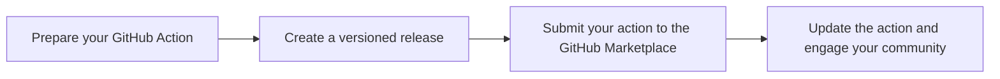

## GitHub Action Flowchart



## GitHub Action Flowchart

```mermaid
graph LR
    A["Prepare your GitHub Action"] --> B["Create a versioned release"]
    B --> C["Submit your action to the GitHub Marketplace"]
    C --> D["Update the action and engage your community"]

## GitHub Action Flowchart

```mermaid
graph LR
    A["Prepare your<br>GitHub Action"] --> B["Create a<br>versioned release"]
    B --> C["Submit your action<br>to the GitHub Marketplace"]
    C --> D["Update the action<br>and engage your community"]
